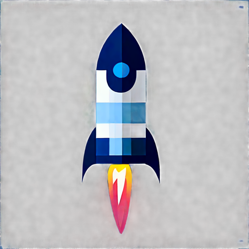

# 🎨 Glassmorphic Asset Generation Guide

This guide will help you generate and integrate beautiful glassmorphic video and image assets for your portfolio website using Leonardo AI and Sora APIs.

## 🚀 Quick Start

### 1. Setup Environment

```bash
# Install dependencies
npm install node-fetch dotenv

# Copy environment template
cp .env.example .env

# Edit .env with your API keys
# LEONARDO_API_KEY=your_leonardo_key_here
# SORA_API_KEY=your_sora_key_from_doppler
```

### 2. Generate Assets

```bash
# Generate all assets (icons + videos)
node generate-assets.js

# Generate only icons
node generate-assets.js --icons-only

# Generate only videos
node generate-assets.js --videos-only
```

### 3. Integrate into Website

```bash
# Automatically update index.html with generated assets
node integrate-assets.js

# Commit and deploy
git add .
git commit -m "Add glassmorphic video assets"
git push
```

## 📁 Asset Structure

```
assets/
└── generated/
    ├── icons/
    │   ├── full-stack.png (1024x1024)
    │   ├── full-stack-small.png (256x256)
    │   ├── ai-integration.png
    │   ├── premium-ui.png
    │   ├── data-viz.png
    │   ├── performance.png
    │   └── security.png
    ├── videos/
    │   ├── full-stack-loop.webm (1s)
    │   ├── ai-integration-loop.webm
    │   ├── shared-panorama.webm (8s)
    │   └── footer-horizon.webm (12s)
    └── manifest.json
```

## 🎯 Asset Specifications

### Static Icons (Leonardo AI)
- **Resolution**: 1024x1024px
- **Format**: PNG with transparency
- **Style**: Glassmorphic, dark mode compatible
- **Glow colors**: Matched to your brand palette

### Video Loops (Sora)
- **Icon loops**: 1 second, seamless, 30fps
- **Panorama**: 8 seconds, 2160x4096px
- **Footer**: 12 seconds, 1920x400px
- **Format**: WebM (VP9) with transparency

## 🔧 Manual Asset Integration

If you prefer manual integration, here's how to add assets to your HTML:

### Feature Card with Video Icon

```html
<div class="feature-card">
    <div class="video-icon">
        <video autoplay loop muted playsinline>
            <source src="assets/generated/videos/full-stack-loop.webm" type="video/webm">
            
        </video>
    </div>
    <h3>Full-Stack Development</h3>
    <p>Expert in React 18, TypeScript, Node.js...</p>
</div>
```

### Panorama Background

```html
<!-- Add after <body> tag -->
<div class="panorama-background">
    <video class="panorama-video" autoplay loop muted playsinline>
        <source src="assets/generated/videos/shared-panorama.webm" type="video/webm">
    </video>
</div>
```

### Footer Video

```html
<!-- Add before </footer> tag -->
<div class="footer-video-container">
    <video class="footer-video" autoplay loop muted playsinline>
        <source src="assets/generated/videos/footer-horizon.webm" type="video/webm">
    </video>
</div>
```

## 🎨 Customization

### Modify Prompts

Edit `generate-assets.js` to customize the prompts:

```javascript
const CAPABILITY_ICONS = [
  {
    id: 'your-custom-icon',
    name: 'Your Feature',
    prompt: 'Your detailed prompt here...',
    emoji: '✨',
  },
  // ...
];
```

### Adjust Video Settings

```javascript
const VIDEO_LOOPS = [
  {
    id: 'custom-video',
    prompt: 'Your video prompt...',
    duration: 5, // seconds
    resolution: { width: 1920, height: 1080 },
  },
];
```

## 🚨 Troubleshooting

### Leonardo AI Issues
- **No transparency**: Ensure `transparency: 'enabled'` in API call
- **Wrong style**: Add "glassmorphic" keyword to prompt
- **API errors**: Check rate limits and quota

### Sora Issues
- **No seamless loop**: Add `loop: true` parameter
- **Large file size**: Adjust CRF value in ffmpeg optimization
- **Generation timeout**: Increase polling timeout

### Integration Issues
- **Videos not playing**: Check autoplay policy, add `muted` attribute
- **Performance issues**: Implement lazy loading, reduce video quality
- **Missing assets**: Check manifest.json for generation status

## 📊 Performance Tips

1. **Lazy Load Videos**
   - Use Intersection Observer (already implemented)
   - Pause videos when not visible

2. **Optimize File Sizes**
   - Target < 1MB for icon loops
   - Target < 5MB for panorama
   - Use aggressive compression for mobile

3. **Provide Fallbacks**
   - Static PNG for each video
   - Reduced motion alternatives
   - Loading states with CSS animations

## 🔄 Update Workflow

When you need to regenerate or update assets:

```bash
# 1. Regenerate specific assets
node generate-assets.js --icons-only

# 2. Re-integrate (preserves existing working assets)
node integrate-assets.js

# 3. Test locally
python -m http.server 8000

# 4. Deploy
git add . && git commit -m "Update assets" && git push
```

## 📝 API Documentation

### Leonardo AI Endpoints
- **Generate**: `POST /generations`
- **Status**: `GET /generations/{id}`
- **Docs**: https://docs.leonardo.ai

### Sora API (via Doppler)
- **Generate**: `POST /video/generations`
- **Status**: `GET /video/generations/{id}`
- **Docs**: Check Doppler dashboard

## 🎉 Next Steps

1. **Monitor Analytics**: Track video engagement
2. **A/B Testing**: Try different animations
3. **Seasonal Updates**: Create holiday-themed versions
4. **Performance Monitoring**: Use Lighthouse for metrics

---

Happy generating! Your glassmorphic portfolio is about to look amazing! ✨